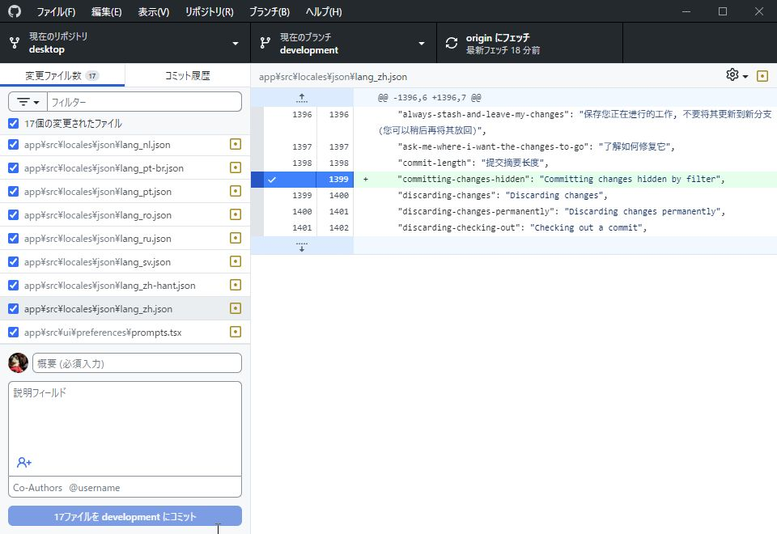

# [GitHub Desktop](https://desktop.github.com) Multilingal Platform

[GitHub Desktop](https://desktop.github.com/) is an open-source [Electron](https://www.electronjs.org/)-based
GitHub app. It is written in [TypeScript](https://www.typescriptlang.org) and
uses [React](https://reactjs.org/).

- This is an unofficial binary distribution of a multi-language platform version. Currently supported languages ​​are English, Japanese, Simplified Chinese, Traditional Chinese and Korean.
- ここでは非公式マルチランゲージプラットホーム バージョンのバイナリー配布を行っています。現在の対応言語は英語、日本語、簡体字、繫体字、ハングルです。
- 这里我们提供了多语言平台版本的非官方二进制分发版。目前支持的语言有英语、日语、简体中文、繫体中文、韩语。
- 여기에서는 비공식 멀티 랭귀지 플랫폼 버전의 바이너리 배포를 실시하고 있습니다. 현재의 대응 언어는 영어, 일본어, 간체 중국어, 번체 중국어, 한국어.

## Where can I get it Multilingal Platform?
 - [macOS(x64)](https://github.com/yasuking0304/desktop/releases/download/original-3.5.5/GitHub.Desktop-x64.zip)  
    For the MacOS version, please execute the included "setenv_lang_macos.sh" after installation.
You only need to run it once.

 - [Windows(x64)](https://github.com/yasuking0304/desktop/releases/download/original-3.5.5/GitHubDesktopSetup-x64.exe)
 - [Linux(x64-AppImage)](https://github.com/yasuking0304/desktop/releases/download/original-3.5.5/GitHubDesktop-linux-x86_64-3.5.5.AppImage)

[Click here for details (This site is only available in Japanese)](https://github.com/yasuking0304/desktop/wiki)

<picture>
  <source
    srcset="./docs/assets/github-desktop-dark.jpg"
    media="(prefers-color-scheme: dark)"
  />
  
</picture>

## License

**[MIT](LICENSE)**

The MIT license grant is not for GitHub's trademarks, which include the logo
designs. GitHub reserves all trademark and copyright rights in and to all
GitHub trademarks. GitHub's logos include, for instance, the stylized
Invertocat designs that include "logo" in the file title in the following
folder: [logos](app/static/logos).

GitHub® and its stylized versions and the Invertocat mark are GitHub's
Trademarks or registered Trademarks. When using GitHub's logos, be sure to
follow the GitHub [logo guidelines](https://github.com/logos).
